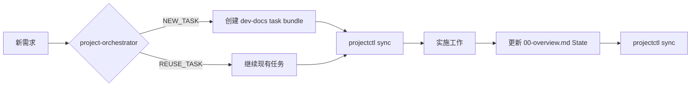

# Project Governance System Summary

本文档整理了项目进度管理系统的目标、方案、实施细节和当前状态。

---

## 1. 目标

### 1.1 核心目标
- 为 AI 代理提供**结构化的项目治理能力**：任务追踪、进度查询、语义映射
- 保持**单一事实来源（SoT）**：任务状态在 `dev-docs/` 中维护，项目语义在 `.ai/project/` 中维护
- 支持**多模块仓库**：可配置多个 `dev-docs` 根目录
- **渐进式披露**：AI 按需读取，不预加载整个治理结构

### 1.2 设计原则
| 原则 | 说明 |
|------|------|
| SoT 分离 | 任务进度 → `dev-docs/`，语义映射 → `.ai/project/` |
| 触发机制收敛 | Skill 选择仅依赖 `description`，不在 AGENTS.md/CONTRACT.md 中路由 |
| 只读 vs 写入 | `project-status-reporter` 只读，`project-orchestrator` 写入 |
| 模板仓库友好 | 运行时数据不预置，用户克隆后 `init` 生成 |

---

## 2. 方案架构

### 2.1 数据模型

```
┌─────────────────────────────────────────────────────────────┐
│                    .ai/project/<project>/                   │
│  ┌─────────────┐  ┌─────────────┐  ┌─────────────────────┐ │
│  │registry.yaml│  │dashboard.md │  │ changelog.md        │ │
│  │ (SoT)       │  │ (derived)   │  │ (append-only log)   │ │
│  └─────────────┘  └─────────────┘  └─────────────────────┘ │
└─────────────────────────────────────────────────────────────┘
                              │
                              │ references
                              ▼
┌─────────────────────────────────────────────────────────────┐
│              dev-docs/**/active/<task>/                     │
│  ┌─────────────────┐  ┌─────────────┐                      │
│  │ 00-overview.md  │  │.ai-task.yaml│                      │
│  │ (status SoT)    │  │ (identity)  │                      │
│  └─────────────────┘  └─────────────┘                      │
└─────────────────────────────────────────────────────────────┘
```

### 2.2 对象模型

| 对象 | ID 格式 | 存储位置 |
|------|---------|----------|
| Project | `P-xxx` | `.ai/project/<slug>/` |
| Milestone | `M-xxx` | `registry.yaml` |
| Feature | `F-xxx` | `registry.yaml` |
| Requirement | `R-xxx` | `registry.yaml` |
| Task | `T-xxx` | `.ai-task.yaml` + `registry.yaml` |

### 2.3 状态枚举

| 状态 | 适用对象 |
|------|----------|
| `planned` | Task, Feature, Requirement, Milestone |
| `in-progress` | Task, Feature, Requirement, Milestone |
| `blocked` | Task, Feature, Requirement, Milestone |
| `done` | Task, Feature, Requirement, Milestone |
| `archived` | Task (由目录位置决定) |
| `cut` | Feature, Requirement (范围移除) |

---

## 3. 实施细节

### 3.1 核心脚本

| 脚本 | 行数 | 功能 |
|------|------|------|
| `projectctl.mjs` | ~1862 | 项目治理主脚本（init/query/lint/sync） |

**命令清单**：
```bash
# 初始化项目中心
node .ai/scripts/projectctl.mjs init --project main

# 查询任务
node .ai/scripts/projectctl.mjs query --project main --text "keyword"
node .ai/scripts/projectctl.mjs query --project main --status in-progress
node .ai/scripts/projectctl.mjs query --project main --id T-001

# 校验（CI 友好）
node .ai/scripts/projectctl.mjs lint --check --project main

# 同步/修复漂移
node .ai/scripts/projectctl.mjs sync --apply --project main
node .ai/scripts/projectctl.mjs sync --apply --project main --changelog
```

### 3.2 Git Hooks

| Hook | 功能 |
|------|------|
| `pre-commit` | `dev-docs/` 文件暂存时自动运行 `projectctl sync` |
| `commit-msg` | 验证 conventional commit 格式 |
| `install.mjs` | 安装/卸载/检查 hooks |

安装命令：
```bash
node .githooks/install.mjs
node .githooks/install.mjs --check
node .githooks/install.mjs --uninstall
```

### 3.3 Skill 矩阵

| Skill | 职责 | 读/写 |
|-------|------|-------|
| `project-orchestrator` | intake → governance decision (reuse/new task, mapping) | Write |
| `project-status-reporter` | 进度快照、下一步建议 | Read-only |
| `project-sync-lint` | 元数据校验 + 漂移修复 | Write |
| `plan-maker` | 创建 roadmap 文档 | Write |
| `plan-code-refactors` | 规划重构阶段 | Write |
| `review-implementation-plans` | 执行前审核 | Read-only |

---

## 4. 文件清单

### 4.1 新增文件

```
.ai/project/
├── AGENTS.md                    # 项目治理入口文档
└── CONTRACT.md                  # 项目契约（SoT 定义）

.ai/scripts/
└── projectctl.mjs               # 核心治理脚本

.ai/skills/workflows/planning/
├── project-orchestrator/
│   └── SKILL.md
├── project-status-reporter/
│   ├── SKILL.md
│   └── reference/
│       ├── blocked-items.md
│       ├── next-action.md
│       ├── progress-summary.md
│       └── task-list.md
└── project-sync-lint/
    ├── SKILL.md
    └── templates/main/          # projectctl init 模板源
        ├── changelog.md
        ├── dashboard.md
        ├── feature-map.md
        ├── registry.yaml
        └── task-index.md

.githooks/
├── commit-msg
├── install.mjs
└── pre-commit
```

### 4.2 修改文件

| 文件 | 修改内容 |
|------|----------|
| `.ai/AGENTS.md` | 简化为 description-only 触发机制 |
| `AGENTS.md` (root) | 更新路由表，指向 `.ai/project/AGENTS.md` |

### 4.3 删除文件

| 文件 | 原因 |
|------|------|
| `.ai/skills/workflows/planning/task-starter/` | 功能合并到 `project-orchestrator` |
| `.ai/project/main/` | 运行时数据，不应预置在模板仓库 |

---

## 5. 当前状态

### 5.1 已完成

- [x] CONTRACT.md 定义完整（SoT、状态模型、校验策略）
- [x] projectctl.mjs 实现 init/query/lint/sync
- [x] Skill description 互斥性优化
- [x] Git hooks 支持自动同步
- [x] 模板文件位于 `project-sync-lint/templates/`

### 5.2 待清理

- [ ] 删除 `.ai/project/main/`（模板仓库不应包含运行时数据）

### 5.3 验证命令

```bash
# Skill lint
node .ai/scripts/lint-skills.mjs --strict

# Skill sync
node .ai/scripts/sync-skills.mjs --yes

# Project lint (需先 init)
node .ai/scripts/projectctl.mjs init --project main
node .ai/scripts/projectctl.mjs lint --check --project main
```

---

## 6. 使用流程

### 6.1 模板用户首次使用

```bash
# 1. 克隆模板
git clone <template-repo> my-project
cd my-project

# 2. 初始化项目中心
node .ai/scripts/projectctl.mjs init --project main

# 3. (可选) 安装 Git hooks
node .githooks/install.mjs
```

### 6.2 日常工作流



### 6.3 进度查询

```bash
# 查看所有任务
node .ai/scripts/projectctl.mjs query --project main

# 查看进行中任务
node .ai/scripts/projectctl.mjs query --project main --status in-progress

# 关键词搜索
node .ai/scripts/projectctl.mjs query --project main --text "auth"
```

---

*文档生成时间：2026-02-05*
