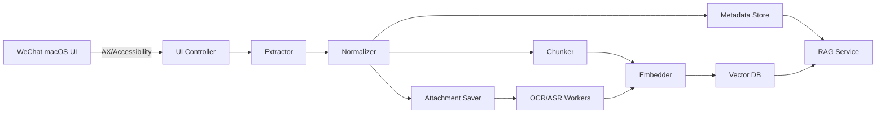

# WeChatRAG（macOS）PRD
> **目的**：在 **macOS 微信**上通过 **UI 自动化（Accessibility/AX）**全自动抓取聊天内容（含图片/语音等附件可选），将其规范化、分段（chunking）、向量化（embedding），写入你的向量数据库以支撑后续应用（主要是 RAG）。  
> **原则**：不读取/不依赖微信本地加密数据库；以可维护、可增量、可回放为第一优先级。

---

## 1. 背景与问题陈述

### 1.1 背景
- 微信聊天记录承载大量业务/知识信息，但微信本身并非为“程序化检索与知识库构建”设计。
- 你需要一个**可搜索、可过滤（联系人/群、时间段、类型等）、可检索增强生成（RAG）**的数据底座。
- 在 macOS 上，直接读取微信内部数据文件通常面临**加密、结构不稳定、合规/安全风险**等问题；UI 自动化是更稳妥的工程路径。

### 1.2 问题陈述
现有痛点：
- 无稳定的官方 API 用于批量导出聊天文本、图片、语音等。
- 人工检索和整理成本高，难以在应用中复用。
- 需要“**增量同步** + **按会话/时间过滤** + **向量检索**”的统一方案。

---

## 2. 目标与非目标

### 2.1 目标（Goals）
1. **全自动 UI 抓取**：自动遍历会话，增量抓取新消息；可配置回补历史。
2. **结构化与可追溯**：消息、附件、派生文本（OCR/ASR）均有稳定 ID/哈希，可回溯原始证据。
3. **向量化 & RAG Ready**：提供可直接用于 RAG 的 chunk 文本与元数据过滤（会话、时间、参与者、类型）。
4. **多模态可选支持**：
   - 图片：自动保存 → OCR/Caption → 入库
   - 语音：自动导出或播放录音 → ASR → 入库
5. **可维护**：UI selector 变动可快速定位与修复（AX 树快照、回归样例）。
6. **隐私与安全默认本地化**：默认本地处理与本地存储；支持可插拔云端 OCR/ASR（用户显式启用）。

### 2.2 非目标（Non-goals）
- 不实现/不依赖：读取微信本地加密数据库（SQLCipher/WCDB 等）的解密与查询。
- 不承诺：100% 覆盖所有消息类型（如部分小程序卡片、红包、表情包等可能仅能存元数据）。
- 不做：自动“发送消息/群发”等高风险动作（降低封号风险与误操作）。

---

## 3. 术语与定义

| 术语 | 定义 |
|---|---|
| Conversation | 会话：单聊或群聊 |
| Message | 消息：文本/图片/语音/文件/链接等 |
| Attachment | 附件：图片文件、语音音频、文档等本地落地文件 |
| Derived Doc | 派生文档：由 OCR/ASR/Caption 生成的可检索文本 |
| Chunk | 检索单元：由多条 message 组合形成的上下文段 |
| Cursor | 会话游标：用于增量抓取的断点信息 |
| AX/Accessibility | macOS 辅助功能接口（AXUIElement） |

---

## 4. 用户画像与使用场景

### 4.1 用户画像
- **个人/团队知识库维护者**：希望把聊天内容沉淀为可检索知识源。
- **研发/产品**：需要构建基于微信信息的 RAG 应用（问答、复盘、检索、总结）。

### 4.2 核心场景（Must-have）
1. **按会话增量同步**：每天/每小时自动同步新消息。
2. **按过滤条件检索**：某联系人/某群 + 时间段 + 语义检索。
3. **RAG 上下文构建**：召回相关 chunk，并可回溯原消息与附件证据。

### 4.3 扩展场景（Nice-to-have）
- 图片中的文字可检索（OCR）。
- 语音内容可检索（ASR）。
- 自动摘要、主题聚类、知识点抽取。

---

## 5. 产品范围与版本规划（按能力层级）

> 这里采用“能力层级”而非时间估算。

### 5.1 MVP（可用最小集）
- 单实例运行（本机）
- UI 自动化抓取：文本消息 + 时间分隔条
- 基础 chunking + embedding + 向量 upsert
- 基础查询接口（过滤 + 相似度检索）
- 游标（cursor）与去重（hash）

### 5.2 V1（可上线稳定）
- 多会话遍历、错误恢复、断点续跑
- 原始抓取事件（raw AX events）落盘与回放
- 图片保存 + OCR 入库
- 可配置回补策略（每天回补 N 屏/会话）
- 运维：日志、运行状态、失败重试

### 5.3 V2（多模态完善）
- 语音导出或播放录音 + ASR 入库
- 文件/链接解析（PDF/Doc/网页摘要）
- 基于对话结构的智能 chunking（话题切分）
- rerank、引用对齐（message-level citation）

---

## 6. 功能需求（Functional Requirements）

### 6.1 安装与权限
**FR-01**：首次运行应检测并引导开启：
- macOS「辅助功能」权限（Accessibility）用于 AX 读取与 UI 操控
- （可选）屏幕录制/音频录制权限（用于语音“播放录音”模式）

**验收**：未授权时给出明确错误与操作指引；授权后可通过自检完成“打开微信 → 读取窗口 → 提取一条文本”。

---

### 6.2 UI 自动化控制（Controller）
#### 6.2.1 微信启动与聚焦
**FR-10**：能启动/激活微信，并聚焦主窗口。  
**FR-11**：若微信弹出更新/提示窗口，能识别并安全退出（不点“发送/删除”类按钮）。

#### 6.2.2 会话枚举与切换
**FR-12**：读取左侧会话列表可见项，逐个进入会话。  
**FR-13**：支持会话白名单/黑名单（仅抓某些群/人）。

#### 6.2.3 定位到底部与滚动回补
**FR-14**：打开会话后先定位到“最新消息”（底部）。  
**FR-15**：按策略向上滚动回补：
- `backfill_mode=none|fixed_screens|until_date|until_cursor_hit`
- `max_screens_per_run` 可配置

**验收**：连续两次运行不会重复写入相同消息；能稳定抓取新增。

---

### 6.3 提取与解析（Extractor/Normalizer）
#### 6.3.1 Item 分类
**FR-20**：从聊天区域 AX 树提取可见 item，并分类：
- `time_separator`
- `message_bubble`（至少 text）
- `message_bubble_nontext`（图片/语音/文件等，仅元数据）

#### 6.3.2 发送者与“是否本人”
**FR-21**：尽可能识别 sender：
- 单聊：对方/我
- 群聊：成员名 + 我
若无法识别，记录 `sender="unknown"` 并保留 AX 证据字段。

#### 6.3.3 时间戳估计
**FR-22**：解析时间分隔条：
- 绝对时间：`YYYY年M月D日 HH:mm`
- 相对时间：`昨天/星期X/上午/下午`
输出 `ts_estimated`（至少分钟粒度）与 `ts_confidence`。

> 设计取舍：秒级时间通常不可得，采用“分钟 + 序号”确保稳定排序。

#### 6.3.4 去重与幂等
**FR-23**：对每条消息生成稳定 hash：  
`sha256(conversation_id + sender + ts_bucket + msg_type + normalized_text + attachment_hashes + local_order)`  
同 hash 不重复入库（幂等）。

---

### 6.4 附件采集（Attachments）
#### 6.4.1 图片
**FR-30**：识别图片气泡后：
- 自动打开图片查看器
- 自动“另存为”到指定目录（按日期/会话分层）
- 计算 `sha256`、尺寸等元信息
- 写入 Attachment 记录

#### 6.4.2 文件
**FR-31**：识别文件气泡后：
- 若可“另存为/下载”，则保存到目录并记录元信息
- 若不可自动下载，则至少记录：文件名/大小（若可见）与 AX 证据

#### 6.4.3 语音
**FR-32**：语音处理支持两种模式（二选一或并行）：
- **Export Mode**：若微信 UI 提供“另存为”，则导出音频文件
- **Record Mode**：无法导出时，自动播放语音并使用系统音频录制采集为 wav/m4a

**验收**：至少一种模式在目标微信版本上可稳定得到可转写音频文件；失败时保留任务并可重试。

---

### 6.5 派生文本流水线（Derived Docs）
#### 6.5.1 OCR（图片→文本）
**FR-40**：对已落地图片执行 OCR：
- 输出 `ocr_text`
- 记录引擎信息（本地/云端、版本）与置信度
- 作为 Derived Doc 入库，并建立 embedding

#### 6.5.2 ASR（语音→文本）
**FR-41**：对落地音频执行 ASR：
- 输出 `asr_text`
- 记录语言、时长、引擎信息
- 作为 Derived Doc 入库，并建立 embedding

#### 6.5.3 Caption（可选）
**FR-42**：可选对图片生成语义描述（caption）以增强召回。

---

### 6.6 Chunking 与 Embedding
**FR-50**：chunk 生成规则（默认）：
- 同一会话内按时间连续性分段：间隔 > 5–10 分钟断开
- chunk 最大长度（token 或字符）阈值：超过则按消息边界切分
- chunk 文本格式：`【HH:mm 发送者】内容` 多行拼接

**FR-51**：embedding 生成：
- 支持配置模型与维度（e.g. 768/1024/1536）
- 对 `chunk` 与 `derived_doc` 都生成 embedding
- embedding 版本化（模型变更可重建索引）

---

### 6.7 存储与索引
#### 6.7.1 原始事件日志（Raw Evidence）
**FR-60**：每次运行输出 `raw_events.jsonl`：包含 AX 关键字段（脱敏可选），用于回放/排障。

#### 6.7.2 元数据存储（Metadata Store）
**FR-61**：保存规范化后的：Conversation、Message、Attachment、DerivedDoc、Chunk、Cursor、IngestRun 等。

#### 6.7.3 向量索引（Vector DB）
**FR-62**：向量索引支持：
- upsert（幂等）
- metadata filter：`conversation_id / time_start~time_end / participants / doc_type`
- top-k 检索

> 实现可选：Qdrant / pgvector / Milvus / Chroma。PRD 以“接口能力”定义，不绑定单一产品。

---

### 6.8 检索接口（供 RAG 调用）
**FR-70**：提供检索 API（本地 HTTP 或 library）：
- `search(query, filters, top_k)` → 返回 chunk/derived_doc 列表
- filters：
  - `conversation_ids`
  - `time_range`
  - `participants/sender`
  - `doc_types`（chunk / image_ocr / voice_asr / file_text 等）
- 返回字段包含：
  - `text`
  - `score`
  - `metadata`
  - `citations`（message_ids / attachment_paths）

---

### 6.9 运行、调度与容错
**FR-80**：支持 `launchd`/cron 定时运行与手动运行。  
**FR-81**：失败重试策略：
- UI 操作失败 → 退回上一步重试 N 次
- OCR/ASR 失败 → 保留任务队列，指数退避重试
**FR-82**：断点续跑：每会话 cursor 持久化。

---

### 6.10 可观测性与运维
**FR-90**：日志分级（INFO/WARN/ERROR）与结构化日志（JSON）。  
**FR-91**：指标：
- 每次运行抓取会话数、消息数、附件数
- OCR/ASR 成功率
- 平均每会话耗时
- selector 命中率（AX 元素识别成功率）

---

## 7. 非功能需求（NFR）

### 7.1 可靠性
- NFR-01：重复运行幂等（不重复写入）。
- NFR-02：断电/崩溃后可从 cursor 恢复。

### 7.2 性能
- NFR-10：增量同步应在可接受时间内完成（与会话数、消息量相关）。
- NFR-11：向量 upsert 批处理，避免单条低效写入。

### 7.3 可维护性
- NFR-20：AX 树快照与回归样本（固定会话的“黄金样例”）。
- NFR-21：selector 规则配置化（避免硬编码）。

### 7.4 安全与隐私
- NFR-30：默认本地存储与本地推理；云端 OCR/ASR 必须显式开启。
- NFR-31：可选脱敏规则（手机号/邮箱/证件号等）。
- NFR-32：本地数据目录可加密（如 FileVault 或应用层加密）。

---

## 8. 交互与操作流程（Operator UX）

### 8.1 初次配置向导
1) 检测微信是否安装/已登录  
2) 引导开启 Accessibility 权限  
3) 选择抓取范围：全量 / 白名单 / 黑名单  
4) 选择附件策略：图片 OCR / 语音 ASR / 文件解析  
5) 选择向量库配置（连接串、collection/table 名）  
6) 试运行（抓取 1 个会话 1 屏）并展示结果

### 8.2 日常运行
- 后台定时跑增量
- 失败则报警（本地通知/邮件/日志）
- 提供“运行摘要报告”（本次新增多少消息/索引多少 chunk）

---

## 9. 数据生命周期与目录规范（建议）

```
~/WeChatRAG/
  config/
    config.yaml
  state/
    cursors.json
    run_history.sqlite   # 可选：用 SQLite 记录运行状态/队列
  raw/
    2026-02-06/
      raw_events.jsonl
      messages.jsonl
      chunks.jsonl
  attachments/
    images/YYYY/MM/DD/<conversation_id>/...
    audio/YYYY/MM/DD/<conversation_id>/...
    files/YYYY/MM/DD/<conversation_id>/...
  derived/
    ocr/YYYY/MM/DD/...
    asr/YYYY/MM/DD/...
  logs/
    app.log
```

---

## 10. 风险与应对

| 风险 | 影响 | 应对 |
|---|---|---|
| 微信 UI/AX 结构变动 | 抓取失败 | selector 配置化 + AX 树快照 + 回归测试 |
| 误操作/点错按钮 | 账号风险 | 禁止“发送/删除/确认”类按钮；操作白名单 |
| 大规模滚动导致微信卡顿 | 性能与稳定性 | 增量优先；回补限速；每会话最大屏数 |
| 时间戳解析不准确 | 时间过滤误差 | 分钟粒度 + 块内序号；保留 time_separator 证据 |
| 语音录制依赖系统配置 | 部署复杂 | 语音先做 Export Mode；Record Mode 作为可选增强 |
| 隐私泄露（云 OCR/ASR） | 高 | 默认本地；云端需显式启用 + 说明数据流 |
| 多模态成本 | 资源消耗 | 异步队列；仅对需要的会话启用 |

---

## 11. 成功指标（Metrics）
- **抓取覆盖**：目标会话中新增消息抓取成功率 ≥ 99%（文本类）
- **幂等性**：重复运行重复写入率 = 0
- **可检索性**：给定查询在目标会话与时间段内命中率显著优于关键词检索
- **稳定性**：连续运行 N 天无人工介入（依赖微信 UI 稳定性）

---

## 12. 验收标准（Acceptance Criteria）

### 文本增量同步
- 能对 ≥ 50 个会话增量抓取新增文本消息并入库
- 同一消息不重复入库（hash 幂等）
- 能按 `conversation_id + time_range` 过滤检索

### 图片 OCR
- 图片能自动另存并生成 OCR 文本入库
- OCR 文本可被向量检索召回并返回图片路径作为引用

### 语音 ASR（若启用）
- 至少一种语音采集模式能稳定产出音频文件
- ASR 文本入库并可被召回

---

## 13. 开放问题（Open Questions）
1. 向量库选型（Qdrant / pgvector / Milvus / Chroma）与部署形态（本地/远端）  
2. OCR/ASR 引擎选择（本地/云端）与隐私策略  
3. 群聊成员 sender 识别在不同 UI 布局下的稳定性  
4. 特殊消息类型（小程序卡片、引用/回复、合并转发）的解析优先级  
5. 语音 Record Mode 的系统录音方案（是否允许额外系统组件）

---

## 14. 附录：建议的系统架构（Mermaid）


